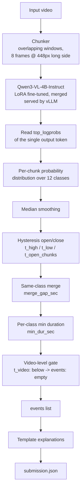

# AHC Visual Intelligence Hackathon — Video Anomaly Detection

Detects 11 event classes (plus `normal`) in drone/CCTV/dashcam footage with a
small vision-language model, fine-tuned as a single-token classifier so
inference is nearly all prefill and every prediction carries a calibrated
confidence score.

## Layout

```
src/       inference pipeline + training-data builder
scoring/   local scorer + event-level metrics for offline threshold tuning
model/     LoRA adapter config (weights not committed — see model/README.md)
webapp/    live demo (FastAPI + browser client)
docs/      problem statement, plan, submission format
examples/  manifest + submission template
```

## Architecture



| Stage | Runs | Cost |
|---|---|---|
| Frame decode + resize | per chunk | CPU/OpenCV |
| VLM forward pass | per chunk | 1 output token, prefill-dominated |
| Smoothing / hysteresis / merge / gate | per video | pure Python |
| Explanation | per event | template lookup |

## The core trick

The model is not fine-tuned to describe video — it answers with exactly one
letter (A–L) per chunk. Reading the `top_logprobs` of that single token and
softmaxing them gives a calibrated probability over the 12 classes for free:
one forward pass instead of a generation loop, a real confidence score instead
of an invented one, and nothing to parse.

## Model

`Qwen/Qwen3-VL-4B-Instruct`, LoRA (rank 16, alpha 32, `all-linear`), frozen ViT.

- Built-in Text-Timestamp Alignment / Interleaved-MRoPE — relevant to Level 2/3
  localisation.
- Frozen vision tower: only the decision layer needs retraining, fits one GPU.

## Why the aggregation logic looks the way it does

- **False alarms are catastrophic** — a normal L2/3 video scores 1.0 for
  predicting nothing, 0.0 for predicting anything. `t_video` gates the whole
  video on this.
- **Fragmentation is punished** — only the best-overlapping prediction per
  real event scores; the rest count against the video. Hysteresis (`t_high`
  open / `t_low` close) and `merge_gap_sec` turn noisy per-chunk spikes into
  one clean interval.
- **`min_dur_sec`** rejects single-chunk blips too short to be that class.
- **`temperature`** softens the saturated post-fine-tune distribution (p^(1/T),
  renormalised) — without it every threshold setting scores identically.

Thresholds were swept jointly against two independent probability caches from
the same model (single-cache sweeps are not reliable here: run-to-run
inference noise moves the level-3 score by up to 0.14 on a small held-out set).

## Data pipeline (`src/build_training_data.py`)

1. Labelled videos, folder name = class. Cut into overlapping chunks.
2. Unlabelled footage, auto-labelled by a local teacher VLM
   (`Qwen2.5-VL-7B-Instruct`), kept only when two passes with reversed frame
   order agree.
3. Balanced to ~45% normal; anomaly classes optionally equalised via
   `--anom_target` using a denser sampling stride for scarce classes.

## Running it

```bash
pip install -r requirements.txt
huggingface-cli download Qwen/Qwen3-VL-4B-Instruct --local-dir ./qwen3vl4b

# training data
python -m src.build_training_data \
  --labelled 'data/train/*/videos/*.mp4' \
  --chunkdir ./chunks --out sft.jsonl

# train
bash train.sh

# serve
swift export --adapters out/vX-.../checkpoint-XXX --merge_lora true
VLLM_USE_FLASHINFER_SAMPLER=0 vllm serve out/.../checkpoint-XXX-merged \
  --served-model-name vad-qwen3vl-4b --max-model-len 8192 \
  --limit-mm-per-prompt '{"image":16}' --dtype bfloat16

# run
VAD_SERVER="http://127.0.0.1:PORT/v1/chat/completions" \
python -m src.pipeline --manifest examples/manifest.json --videos ./videos \
  --out submission.json
```

`--freeze_vit true` is required at 4B scale on a single GPU. On some CUDA 13
setups, `swift sft`'s backward pass needs `libnvrtc-builtins.so.13.0` on
`LD_LIBRARY_PATH` (ships inside `nvidia-cuda-nvrtc`, not on the default path).

## Live demo

```bash
python webapp/server.py   # http://localhost:8420
```

Drop in a video and watch per-chunk verdicts stream in over SSE as they land.
For the held-out labelled videos, the timeline also shows the ground-truth
interval and the literal IoU overlap region — the same quantity the task is
scored on, drawn rather than only reported.

## Known limitations

- Temporal localisation on long, sustained anomalies is the main gap: the
  model is trained on trimmed clips where the whole clip is the anomaly, so on
  a long video it tends to label every visually-similar window, and events
  come out over-extended. Discrete events (e.g. a collision) localise well
  (measured AUC 1.0 on one held-out video); sustained ones (e.g. developing
  congestion) localise poorly (AUC 0.34 on another) — the underlying
  probabilities are informative about *what*, not reliably about *when*.
- `vehicle_blocking_traffic` is confused with parked vehicles in some contexts
  (e.g. a motorway service area) — a training-data gap in that class, not a
  thresholding issue.
- Given more time: more training data for the weakest classes, and a
  purpose-built temporal head (the architecture several other approaches on
  this task use) rather than a fine-tuned VLM's own aggregation logic.
