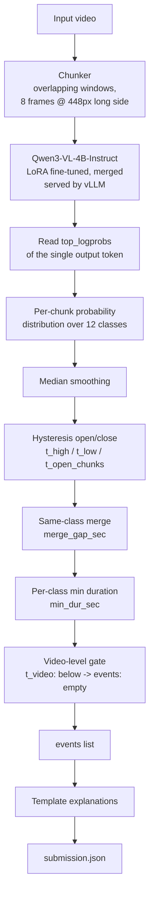

# AHC Visual Intelligence Hackathon — Real-Time Video Anomaly Detection

Detects the 11 event classes (plus `normal`) in drone / CCTV / dashcam footage using a small
vision-language model, fine-tuned as a single-token classifier so inference is nearly all
prefill and every prediction carries a calibrated confidence score.

## Architecture



**Per-frame vs per-clip work**

| Stage | Runs | Cost |
|---|---|---|
| Frame decode + resize | per chunk (8 frames, overlapping windows) | CPU/OpenCV, cheap |
| VLM forward pass | per chunk | 1 output token → mostly prefill, no long decode |
| Smoothing / hysteresis / merge / gate | per video, once | pure Python, ~0ms |
| Explanation | per event | template lookup, no model call |

## The core trick

The model is **not** fine-tuned to describe video. It is fine-tuned to answer with exactly
one letter (A–L) for a short chunk of frames. At inference we read the `top_logprobs` of
that single token, softmax them, and get a calibrated probability distribution over the 12
classes for free. This buys three things simultaneously:

1. **Speed** — one output token means inference is nearly all prefill; no multi-token
   autoregressive decode per chunk.
2. **A real confidence score** — impossible to get cleanly from free-text generation, but
   trivial from logprobs on a single classification token. This is what the hysteresis /
   gating thresholds operate on.
3. **Zero format-breakage risk** — there is no JSON or free text to parse or repair mid-run.

## Model choice

`Qwen/Qwen3-VL-4B-Instruct`, LoRA SFT, frozen vision tower.

- Built-in Text-Timestamp Alignment and Interleaved-MRoPE, purpose-built for video event
  localisation — directly relevant to Levels 2–3.
- ~9GB in bf16, fits and serves fast on a single modern GPU.
- Day-one LoRA recipes across ms-swift / LLaMA-Factory / Unsloth — nothing about the
  training path is exploratory under a hard time budget.
- Rejected Qwen3.5-4B despite better raw benchmarks: thinking mode on by default and a
  hybrid GDN+MoE architecture are not something to debug with a few hours on the clock.

## Why the aggregation logic looks the way it does

The scoring rules punish two very specific failure modes, and the pipeline is built
directly around avoiding them:

- **False alarms are catastrophic.** A normal Level-2/3 video scores 1.0 for predicting
  nothing and 0.0 for predicting anything. The **video-level gate** (`t_video`) exists
  purely to protect normal videos: if no chunk in the whole clip crosses that bar, the
  video emits `events: []` regardless of anything else.
- **Fragmentation is punished, not rewarded.** Several partial intervals for one real
  event only let the single best-overlapping one score; the rest count against the video.
  **Hysteresis** (`t_high` to open, lower `t_low` to keep an already-open event alive) and
  **same-class merging** (`merge_gap_sec`) exist purely to turn a noisy run of per-chunk
  spikes into one clean interval instead of several fragments.
- **Per-class minimum duration** (`min_dur_sec`) rejects single-chunk blips for event
  types that cannot plausibly be that short (e.g. a stalled vehicle needs to actually be
  stationary for a while before it counts).

## Data pipeline (`sftdata.py`)

1. **Labelled source (free, exact):** the organiser-provided `train/<class>/videos/*.mp4`
   tree, where the folder name already matches one of the 12 target classes directly —
   no benchmark-label mapping needed for this source. Cut into overlapping 2s / 8-frame
   chunks, capped per video, and written straight to the training set.
2. **Unlabelled source (teacher-distilled, free):** any additional unlabelled drone/CCTV
   footage is auto-labelled by a **local** larger open VLM (`Qwen2.5-VL-7B-Instruct`, run
   on the same GPU with no API key and no per-call cost — used only for offline training
   data generation, never at runtime, per the hackathon's rule that larger models can
   generate training data but cannot be part of the deployed detector). Two independent
   passes with different frame orderings must agree before a chunk is kept, as a cheap
   self-consistency filter.
3. **Balancing:** the set is rebalanced so ~45% of samples are `normal`, because a false
   alarm is the single most expensive failure mode in scoring.

## Files

| File | Purpose |
|---|---|
| `vad_pipeline.py` | Inference + submission pipeline. Chunking, model calls, aggregation, validation. |
| `sftdata.py` | Builds the LoRA SFT dataset from labelled + teacher-labelled sources. |
| `scorer.py` | Local re-implementation of the arena's scoring rules, for offline threshold tuning against a held-out labelled set. |
| `cache_chunks.py` | Caches raw per-chunk model probabilities so threshold sweeps don't need to re-query the model. |
| `sweep_thresholds.py` | Grid search over `CFG` thresholds against cached probabilities + the scorer. |

## Running it

```bash
# env
pip install "transformers>=4.57" "qwen_vl_utils>=0.0.14" "ms-swift>=4.0" "vllm>=0.11.0" opencv-python
huggingface-cli download Qwen/Qwen3-VL-4B-Instruct --local-dir ./qwen3vl4b

# data
python sftdata.py \
  --labelled 'data/Train and Test/train/*/videos/*.mp4' \
  --unlabelled 'data/drone/*.mp4' \
  --chunkdir ./chunks --out sft.jsonl --max_per_video 12

# train (freeze_vit is not optional at 4B on a single consumer/prosumer GPU)
MAX_PIXELS=200704 VIDEO_MAX_PIXELS=200704 \
LD_LIBRARY_PATH="$(python3 -c 'import nvidia.cu13,os;print(os.path.dirname(nvidia.cu13.__file__)+"/lib")'):$LD_LIBRARY_PATH" \
swift sft \
  --model ./qwen3vl4b --model_type qwen3_vl --tuner_type lora \
  --dataset sft.jsonl \
  --freeze_vit true --lora_rank 16 --lora_alpha 32 --target_modules all-linear \
  --torch_dtype bfloat16 --num_train_epochs 2 \
  --per_device_train_batch_size 1 --gradient_accumulation_steps 16 \
  --learning_rate 1e-4 --warmup_ratio 0.05 \
  --save_steps 200 --logging_steps 10 --output_dir out

swift export --adapters out/vX-.../checkpoint-XXX --merge_lora true

# serve
VLLM_USE_FLASHINFER_SAMPLER=0 vllm serve out/.../checkpoint-XXX-merged \
  --served-model-name vad-qwen3vl-4b --max-model-len 8192 \
  --limit-mm-per-prompt '{"image":16}' --dtype bfloat16

# run
VAD_SERVER="http://127.0.0.1:PORT/v1/chat/completions" \
python vad_pipeline.py --manifest manifest.json --videos ./videos --out submission.json
```

Two environment quirks worth knowing if reproducing this on a different box:
`--freeze_vit true` is required at 4B scale to keep training memory manageable, and on
some CUDA 13 setups `swift sft`'s backward pass needs `libnvrtc-builtins.so.13.0`
findable via `LD_LIBRARY_PATH` (it ships inside the `nvidia-cuda-nvrtc` pip package but
isn't on the default linker path).

## Limitations / what we'd do with more time

- Thresholds are tuned against a single local held-out set (34 videos, matching the
  arena's own manifest) using an approximate local re-implementation of the scoring rules
  — not the real grader, so treat the exact numbers as directional rather than exact.
- The bulk of `train/` (11 of 12 classes) was only partially available at submission time
  due to a shared-link Google Drive download quota being exhausted across many concurrent
  hackathon participants pulling the same dataset link; a fine-tuning run against the
  full balanced set was still in progress. With more time / a faster data channel, the
  next step is completing that LoRA run, re-sweeping thresholds against the fine-tuned
  model's calibrated confidence, and adding a lightweight temporal-consistency check
  (e.g. requiring agreement across a short window before opening slow-building event
  types like congestion, distinct from fast events like accidents).
